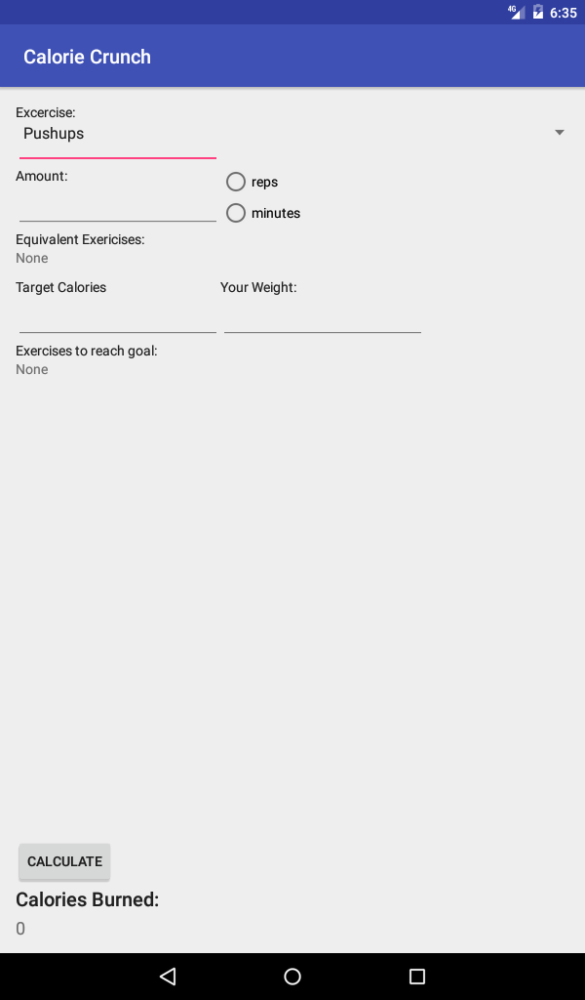
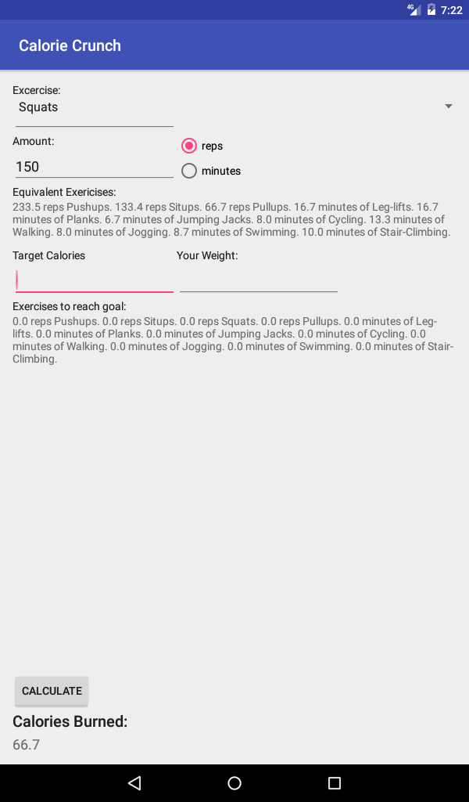
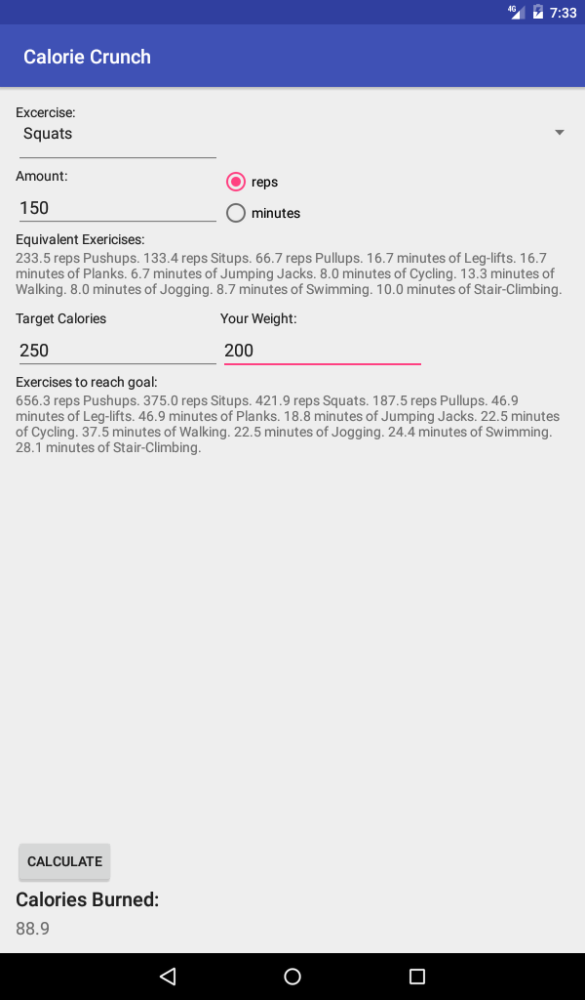

# Calorie-Crunch

Calorie Crunch is an app that helps an user keep track of how many calories they are burning through physical activity. See the more detailed writeup and general usage instructions in the `CalorieCrunch.pdf` file.

In-App Screenshots

 
 

